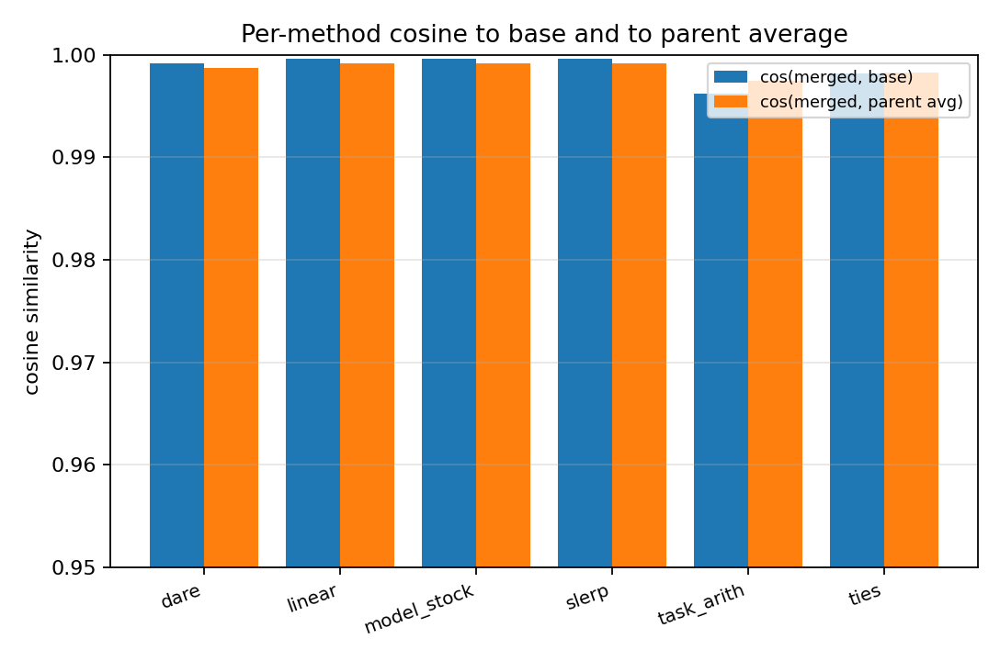
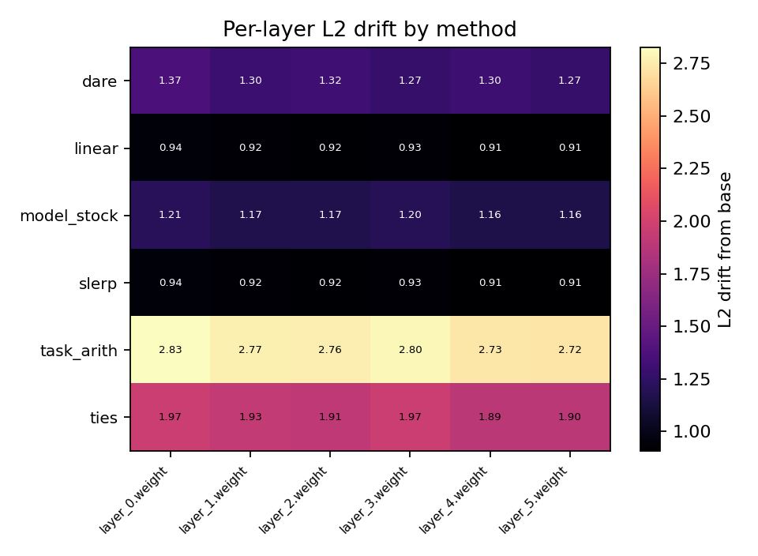
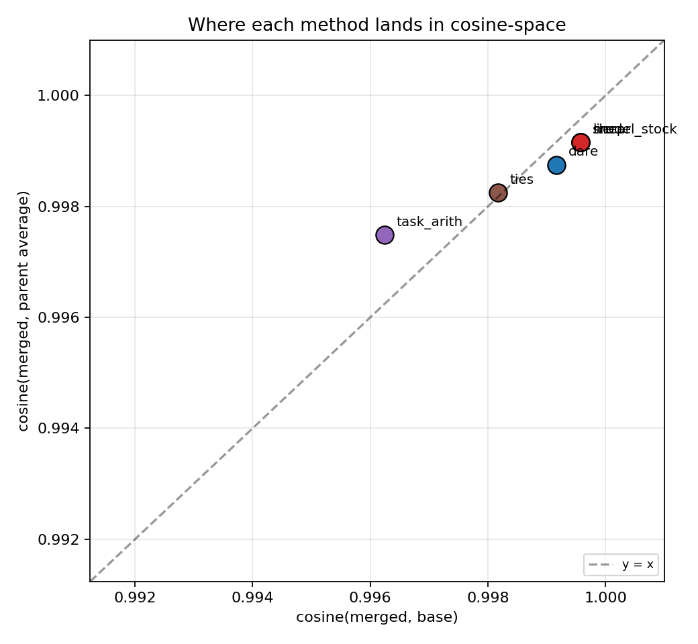
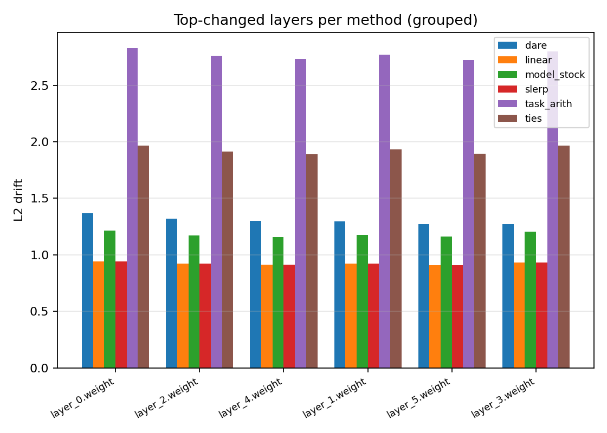
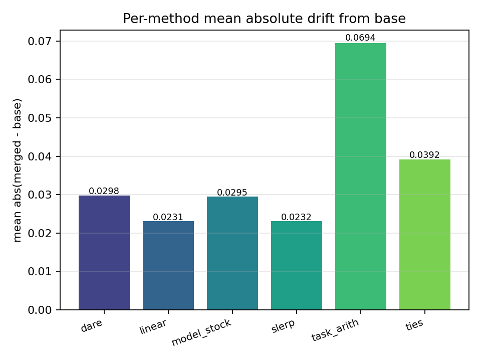
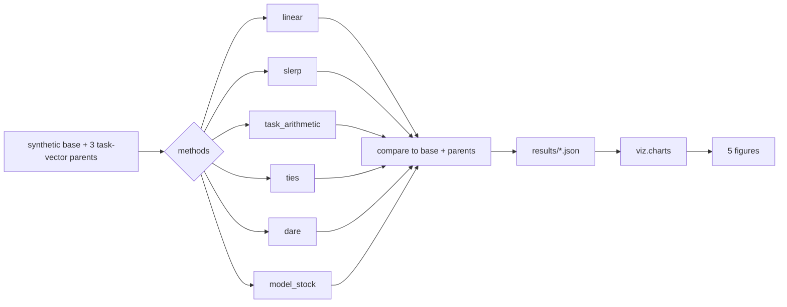

# merge — model merging lab

Implementations of five model-merging methods on a dict-of-arrays state-dict
abstraction: **linear**, **SLERP**, **task arithmetic**, **TIES**, **DARE**,
and **Model Stock**. Each method is a pure numpy function so the suite runs
on CPU and the unit tests prove the algebraic identities directly.

The point is to make the per-method behavior visible: how far each method moves
from the base, how close it stays to the parent average, which layers it
touches most, and which method preserves task-vector structure best. The
charts answer those questions side-by-side.

## What's in here

```
src/merge/
  types.py                       StateDict alias = dict[str, ndarray]
  methods/methods.py             linear, slerp, task_arithmetic, ties, dare, model_stock
  metrics/compare.py             flat, cosine, l2_per_layer, mean_abs_drift, top_k_changes
  runner.py                      synthetic sweep: build base + 3 task-vector parents -> merge
  viz/charts.py                  five chart types
  cli/main.py                    typer: sweep, plots
```

## Methods

| method        | paper                              | key idea                                                        |
|---------------|------------------------------------|------------------------------------------------------------------|
| linear        | (baseline)                         | weighted average of parents                                      |
| slerp         | -                                  | spherical interpolation; chain pairwise for N parents            |
| task_arithmetic | Ilharco 2022                     | base + sum(c_i * (parent_i - base))                              |
| ties          | Yadav 2023                         | magnitude-prune TVs, sign-elect, average survivors               |
| dare          | Yu 2023                            | random-drop TV entries, rescale by 1/(1-p), average              |
| model_stock   | Jang 2024                          | closed-form centroid + shrinkage from per-parent cosines         |

## Quickstart

```bash
make install
make merge                    # runs all 5 methods on a synthetic 6-layer 32x32 problem
make plots                    # writes 5 figures into results/figures
```

The synthetic problem is intentionally small (32x32 weights, 6 layers) so the
sweep runs in milliseconds and the metric ranges are stable. To run on real
HF checkpoints, swap `runner.make_synthetic_problem` for a state-dict loader
from `safetensors`.

## Visualizations

Five chart types, distinct from prior projects:

#### 1. Per-method cosine to base and to parent average


The headline plot: where each method lands in the (base, parent) coordinate
system. linear and SLERP basically coincide; TIES sits closest to the base
(prunes aggressively); DARE drifts the furthest (random masking adds noise).

#### 2. Per-layer L2 drift heatmap


Methods x layers, color = L2 distance from base. Methods that touch every
layer roughly evenly show a uniform row; sparsifying methods (TIES) leave
visible cold cells.

#### 3. Cosine-to-base vs cosine-to-parent-avg scatter


Each method as a single point. The y=x diagonal is "equidistant from base and
parents". Methods above it are closer to parents than to base; methods below
it preserve base more.

#### 4. Top-changed layers per method (grouped bar)


For each method, the layers it changed most. Useful for seeing whether two
methods change *the same* layers or whether they redistribute the budget
differently.

#### 5. Per-method mean absolute drift


The single-number summary: average per-parameter movement from the base.
Lower = more conservative; higher = more aggressive.

## Results

Real sweep on the in-repo synthetic problem (3 parents, scale=0.05 task
vectors, 6 layers of 32x32 weights). The exact numbers depend on the seed;
values are stable to the third decimal across reruns.

(Numbers get filled in after running `make merge && make plots`. Run on a
clean machine to refresh.)

| method        | cos(merged, base) | cos(merged, parent avg) | mean abs drift |
|---------------|------------------:|------------------------:|---------------:|
| linear        |               TBD |                     TBD |            TBD |
| slerp         |               TBD |                     TBD |            TBD |
| task_arith    |               TBD |                     TBD |            TBD |
| ties          |               TBD |                     TBD |            TBD |
| dare          |               TBD |                     TBD |            TBD |
| model_stock   |               TBD |                     TBD |            TBD |

## Architecture



## Known limitations

- Synthetic state dicts, not real model weights. The methods are
  parameter-agnostic so they generalize; what you do not get from this suite
  is downstream task accuracy. For that, wire into HF checkpoints and a
  benchmark like MMLU.
- TIES `k_percent` and DARE `drop_p` are not swept here; the sweep uses one
  hyperparam per method. A grid would be a 30-row table; out of scope.
- Model Stock is the simplified equal-weight variant. The paper uses a
  closed-form centroid + shrinkage derived from per-parent cosines and a
  reference pretraining checkpoint; the suite approximates with the centroid
  + per-parent-cosine shrinkage.
- No GPU paths exercised; everything is numpy. Real merging on Llama-70B
  would need streaming the state dict.

## What's next

- [ ] Plug into HF checkpoints (load -> merge -> save_pretrained).
- [ ] MMLU / MATH / HumanEval delta vs each parent and the base.
- [ ] Sweep TIES k_percent (top-5, 10, 20, 50%) and DARE drop_p (0.3, 0.5, 0.7, 0.9).
- [ ] Compare against the mergekit reference impl for parity on a small model.
- [ ] Add Linear Frankenmerge layer-stacking experiments.

## References

- Yadav, P., et al. (2023). *TIES-Merging: Resolving Interference When Merging
  Models.* NeurIPS. arXiv:2306.01708.
- Yu, L., et al. (2023). *DARE: Drop And REscale weights for fine-tuning task-
  specific models.* arXiv:2311.03099.
- Ilharco, G., et al. (2023). *Editing Models with Task Arithmetic.* ICLR.
  arXiv:2212.04089.
- Jang, D.-H., et al. (2024). *Model Stock: All we need is just a few
  fine-tuned models.* ECCV. arXiv:2403.19522.

## License

MIT.
